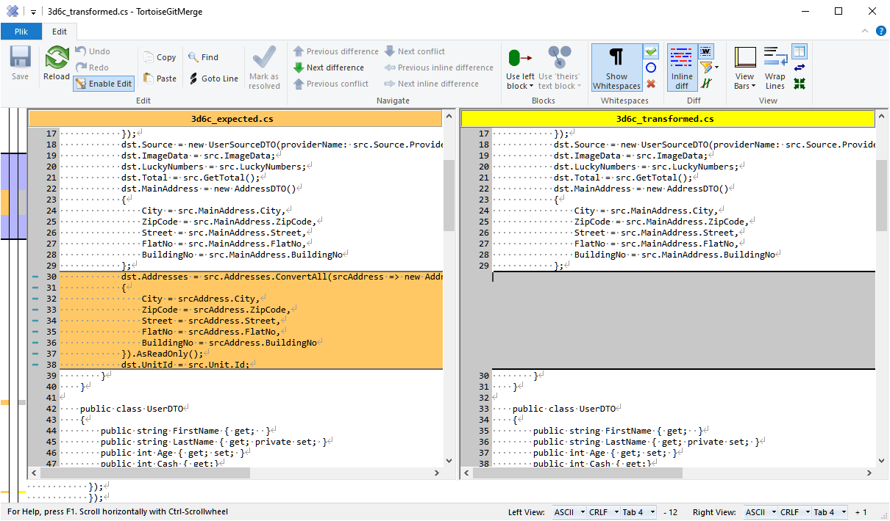

# RoslynTestKit

<!-- Status -->


<!-- Distribution -->
[](https://www.nuget.org/packages/ALCops.RoslynTestKit/)
[](https://www.nuget.org/packages/ALCops.RoslynTestKit/)

<!-- Metadata -->


A lightweight framework for writing unit tests for Roslyn diagnostic analyzers, code fixes, refactorings, and completion providers targeting the [AL Language](https://learn.microsoft.com/en-us/dynamics365/business-central/dev-itpro/developer/devenv-programming-in-al) of Microsoft Dynamics 365 Business Central. This project is a fork of [RoslynTestKit](https://github.com/cezarypiatek/RoslynTestKit), created to support the specific CodeAnalysis assemblies required by the AL language.

|CSharp|AL|
|--|--|
|Microsoft.CodeAnalysis|Microsoft.Dynamics.Nav.CodeAnalysis|
|Microsoft.CodeAnalysis.CodeActions|Microsoft.Dynamics.Nav.CodeAnalysis.CodeActions|
|Microsoft.CodeAnalysis.CodeFixes|Microsoft.Dynamics.Nav.CodeAnalysis.CodeFixes|
|Microsoft.CodeAnalysis.CodeRefactorings|Microsoft.Dynamics.Nav.CodeAnalysis.CodeRefactoring|
|Microsoft.CodeAnalysis.Completion|Microsoft.Dynamics.Nav.CodeAnalysis.Workspaces.Completion|
|Microsoft.CodeAnalysis.Diagnostics|Microsoft.Dynamics.Nav.CodeAnalysis.Diagnostics|
|Microsoft.CodeAnalysis.Text|Microsoft.Dynamics.Nav.CodeAnalysis.Text|
||Microsoft.Dynamics.Nav.CodeAnalysis.Workspaces.dll|


### Quick Start

1. Install the [ALCops.RoslynTestKit](https://www.nuget.org/packages/ALCops.RoslynTestKit/) package from NuGet into your project.
2. Create appropriate test fixture using `RoslynFixtureFactory`.
3. Configure the fixture to perform assertions.

### Dependencies

This is a minimal test project setup example with `NUnit` and the `RoslynTestKit`. We need minimal target `net8.0` and depedencies to `Microsoft.Dynamics.Nav.CodeAnalysis.dll` and `Microsoft.Dynamics.Nav.CodeAnalysis.Workspaces.dll`. 

```xml
<Project Sdk="Microsoft.NET.Sdk">
    <PropertyGroup>
        <TargetFramework>net8.0</TargetFramework>
    </PropertyGroup>
    <ItemGroup>
        <PackageReference Include="ALCops.RoslynTestKit" Version="1.0.0" />
        <PackageReference Include="Microsoft.CodeAnalysis.Common" Version="4.14.0" />
        <PackageReference Include="Microsoft.CodeAnalysis.CSharp" Version="4.14.0" />
        <PackageReference Include="Microsoft.NET.Test.Sdk" Version="17.10.0" />
        <PackageReference Include="NUnit" Version="4.1.0" />
        <PackageReference Include="NUnit3TestAdapter" Version="4.5.0" />
        <PackageReference Include="NUnit.Analyzers" Version="4.2.0" />
        <PackageReference Include="System.Collections.Immutable" Version="8.0.0" />
        <Using Include="NUnit.Framework" />
    </ItemGroup>
    <ItemGroup>
        <ProjectReference Include="src/MyCodeAnalyzer.csproj" />
    </ItemGroup>
    <ItemGroup>
        <Reference Include="Microsoft.Dynamics.Nav.CodeAnalysis">
            <SpecificVersion>False</SpecificVersion>
            <HintPath>myFolder/Microsoft.Dynamics.Nav.CodeAnalysis.dll</HintPath>
            <Private>True</Private>
        </Reference>
        <Reference Include="Microsoft.Dynamics.Nav.CodeAnalysis.Workspaces">
            <SpecificVersion>False</SpecificVersion>
            <HintPath>myFolder/Microsoft.Dynamics.Nav.CodeAnalysis.Workspaces.dll</HintPath>
            <Private>True</Private>
        </Reference>
    </ItemGroup>
</Project>
```

### Code location markers

RoslynTestKit accepts strings that are marked up with ```[|``` and ```|]``` to identify a particular span. This could represent the span of an expected diagnostic or the text selection before a refactoring is applied. 
Instead of the markers you can also provide line number to locate the place of expected diagnostic.

### Example: Test presence of a diagnostic

Create a `FlowFieldEditable.al` file which the AL compiler can parse and apply the code location markers.

##### FlowFieldEditable.al

```AL
table 50100 MyTable
{
    fields
    {
        field(1; MyField; Integer) { }
        [|field(2; MyCalcField; Boolean)|]
        {
            FieldClass = FlowField;
            CalcFormula = exist(MyTable where (MyField = field(MyField)));
        }
    }
}
```

Create a C# class to execute the tests. It's best practice to always use the `HasDiagnosticAtAllMarkers` method, especially when one of the `.al` files contain multiple markers.

```C#
[Test]
[TestCase("FlowFieldEditable")]
[TestCase("FlowFieldEditableWithoutComment")]
...
[TestCase("n")]
public async Task HasDiagnostic(string testCase)
{
    var code = await File.ReadAllTextAsync($"{testCase}.al").ConfigureAwait(false);
    var fixture = RoslynFixtureFactory.Create<MyCodeAnalyzer.Rules.FlowFieldsShouldNotBeEditable>();
    fixture.HasDiagnosticAtAllMarkers(code, DiagnosticIds.FlowFieldsShouldNotBeEditable);
}
```

### Example: Test absence of a diagnostic

Create a `FlowFieldObsoleteRemoved.al` file which the AL compiler can parse and apply the code location markers.

##### FlowFieldObsoleteRemoved.al

```AL
table 50100 MyTable
{
    fields
    {
        field(1; MyField; Integer) { }
        [|field(2; MyCalcField; Boolean)|]
        {
            FieldClass = FlowField;
            CalcFormula = exist(MyTable where (MyField = field(MyField)));
            ObsoleteState = Removed;
        }
    }
}
```

Create a C# class to execute the tests. It's best practice to always use the `NoDiagnosticAtAllMarkers` method, especially when one of the `.al` files contain multiple markers.

```C#
[Test]
[TestCase("FlowFieldObsoleteRemoved")]
[TestCase("FlowFieldTableObsoleteRemoved")]
...
[TestCase("n")]
public async Task NoDiagnostic(string testCase)
{
    var code = await File.ReadAllTextAsync($"{testCase}.al").ConfigureAwait(false);
    var fixture = RoslynFixtureFactory.Create<Analyzer.FlowFieldsShouldNotBeEditable>();
    fixture.NoDiagnosticAtAllMarkers(code, DiagnosticIds.FlowFieldsShouldNotBeEditable);
}
```

#### Example: Test code fix behavior

Create two files: `current.al` and `expected.al`.
Place the diagnostic marker in the `current.al` and in `expected.al` define the expected result without the markers.

##### current.al

```AL
table 50100 MyTable
{
    fields
    {
        field(1; MyField; Integer) { }
        [|field(2; MyCalcField; Boolean)|]
        {
            FieldClass = FlowField;
            CalcFormula = exist(MyTable where (MyField = field(MyField)));
        }
    }
}

```

##### expected.al

```AL
table 50100 MyTable
{
    fields
    {
        field(1; MyField; Integer) { }
        field(2; MyCalcField; Boolean)
        {
            FieldClass = FlowField;
            CalcFormula = exist(MyTable where (MyField = field(MyField)));
            Editable = false;
        }
    }
}

```

Create a C# class to execute the tests.

```C#
[Test]
[TestCase("SingleFlowFieldIsEditable")]
public async Task HasFix(string testCase)
{
    var currentCode = await File.ReadAllTextAsync("current.al").ConfigureAwait(false);
    var currentCode = await File.ReadAllTextAsync("expected.al").ConfigureAwait(false);

    var fixture = RoslynFixtureFactory.Create<FlowFieldsShouldNotBeEditableCodeFixProvider>(
        new CodeFixTestFixtureConfig
        {
            AdditionalAnalyzers = [new Analyzer.FlowFieldsShouldNotBeEditable()]
        });

    fixture.TestCodeFix(currentCode, expectedCode, DiagnosticDescriptors.FlowFieldsShouldNotBeEditable);
}
```

### NavCodeAnalysisBase
The `NavCodeAnalysisBase` class is a base class for analyzer tests that need to behave differently depending on the version of the AL Language (`Microsoft.Dynamics.Nav.CodeAnalysis`). By inheriting from this class, your tests automatically gain utilities for:
* Detecting the currently loaded Microsoft.Dynamics.Nav.CodeAnalysis assembly version.
* Comparing that version against minimum/maximum requirements.
* Skipping or adjusting tests when features are introduced, changed, or removed between versions.

```CS
// Example 1: Skip specific test cases based on version
[TestCase("FeatureOne")]
[TestCase("FeatureTwo")]
public void TestFeatures(string testCase)
{
    SkipTestIfVersionIsTooLow(
        ["FeatureOne"],
        testCase,
        "15.0.0"
    );
    
    SkipTestIfVersionIsTooHigh(
        ["FeatureTwo"],
        testCase,
        "14.9.99"
    );
    // Test code
}

// Example 2: Require minimum version for entire test
[Test]
public void TestModernFeature()
{
    RequireMinimumVersion("15.0.0", "Requires new API");
    // Test code that uses version 15+ features
}

// Example 3: Test feature that only exists in specific range
[Test]
public void TestTransitionalFeature()
{
    RequireVersionRange("15.0.0", "16.5.0", "Feature deprecated after 16.5");
    // Test code
}

// Example 4: Ensure version detection worked
[Test]
public void TestVersionDependentBehavior()
{
    RequireVersionDetection();
    // Now safe to use version comparison methods
}
```

### Basic folder structure

Working with `.al` files instead of declaring the code inline the test method itself, requires a structure. A example for this could be something like this.

```bash
├───MyCodeAnalyzer.Test
│   └──Rules
│      ├───FlowFieldsShouldNotBeEditable
│      │   ├───HasDiagnostic
│      │   │   ├───FlowFieldEditable.al
│      │   │   ├───FlowFieldEditableWithoutComment.al
│      │   │   └───X.al
│      │   └───NoDiagnostic
│      │   │   ├───FlowFieldObsoleteRemoved.al
│      │   │   ├───FlowFieldTableObsoleteRemoved.al
│      │   │   └───X.al
│      │   └───HasFix
│      │   │   └───SingleFlowFieldIsEditable
│      │   │   │   ├───current.al
│      │   │   │   └───expected.al
│      │   │   └───SingleFlowFieldIsEditableWithComment
│      │   │   │   ├───current.al
│      │   │   │   └───expected.al
│      ├───MyOtherDiagnostic
│      │   ├───HasDiagnostic
│      │   └───NoDiagnostic
│      │   └───HasFix
```

## Code comparison

In case of discrepancy between the expected code and the generated one, when testing `CodeFixes` and `CodeRefactorings`, the `TransformedCodeDifferentThanExpectedException` is thrown. The Text difference is presented in the console using inline diff format, which looks as follows:

```plaintext
RoslynTestKit.TransformedCodeDifferentThanExpectedException : Transformed code is different than expected:
===========================
From line 25:
- ················ZipCode·=·src.MainAddress.ZipCode,␍␊
===========================
From line 29:
- ············dst.Addresses·=·src.Addresses.ConvertAll(srcAddress·=>·new·AddressDTO()␍␊
- ············{␍␊
- ················City·=·srcAddress.City,␍␊
- ················ZipCode·=·srcAddress.ZipCode,␍␊
- ················Street·=·srcAddress.Street,␍␊
- ················FlatNo·=·srcAddress.FlatNo,␍␊
- ················BuildingNo·=·srcAddress.BuildingNo␍␊
- ············}).AsReadOnly();␍␊
- ············dst.UnitId·=·src.Unit.Id;␍␊
===========================
From line 71:
- ········public·string·ZipCode·{·get;·set;·}␍␊
+ ········public·string·ZipCode·{·get;·}␍␊
===========================
From line 94:
- ········public·List<AddressEntity>·Addresses·{·get;·set;·}␍␊
- ········public·UnitEntity·Unit·{·get;·set;·}␍␊
===========================
From line 124:
- ········public·string·BankName·{·get;·set;·}␍␊
+ ············public·string·BankName·{·get;·set;·}␍␊
```


However, when the test is run with the attached debugger, an external `diff tool` is launched to present the differences. RoslynTestKit is using under the hood the [ApprovalTests.Net](https://github.com/approvals/ApprovalTests.Net) so a wide range of diff tools on `Windows`, `Linux` and `Mac` are supported.



## Contributors
Appreciation to all the amazing contributors who made this happen.

A special thank you to [@christophstuber](https://github.com/christophstuber}), who originally developed this for AL Language and made it available with the [LinterCop](https://github.com/StefanMaron/BusinessCentral.LinterCop) and to [@ans-bar-bm](https://github.com/ans-bar-bm) for implementing multiple test markers.